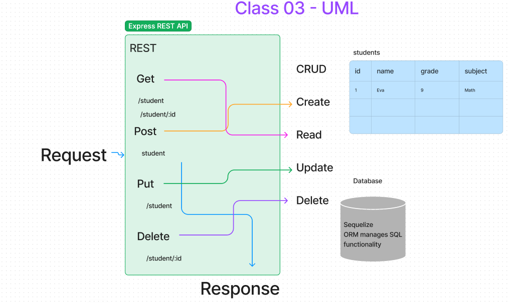
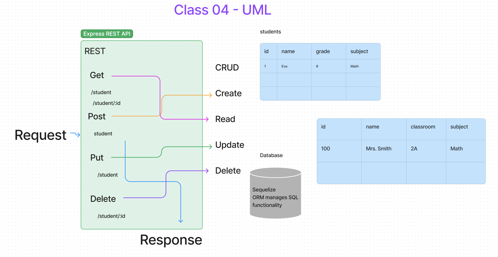

# LAB - Class 03

## Project: Api-Server

### Author: Eva Grace Smith

### Problem Domain

Express Crud Server

### Links and Resources

- [Render Site](https://api-server-ilup.onrender.com)

## UML

### Collaborators

TA: [Daniel Frey](https://github.com/DSFrey), Matt Miguel,

Classmates: Kati Lee, Tim Maupin

### Setup

npm i

#### `.env` requirements (where applicable)

for now I have none and do not require one

#### How to initialize/run your application (where applicable)

`npm start`

#### How to use your library (where applicable)

#### Features / Routes

- Feature One: SQL data models using the Sequelize library
- GET : `/student`
        `/teacher`
        `/student/:id` (Get One)
        `/teacher/:id` (Get One)

- POST: `/student`
        `/teacher`

- PUT: `/student/`
        `/teacher/`

- DELETE `/student/:id`
        `/teacher/:id`

