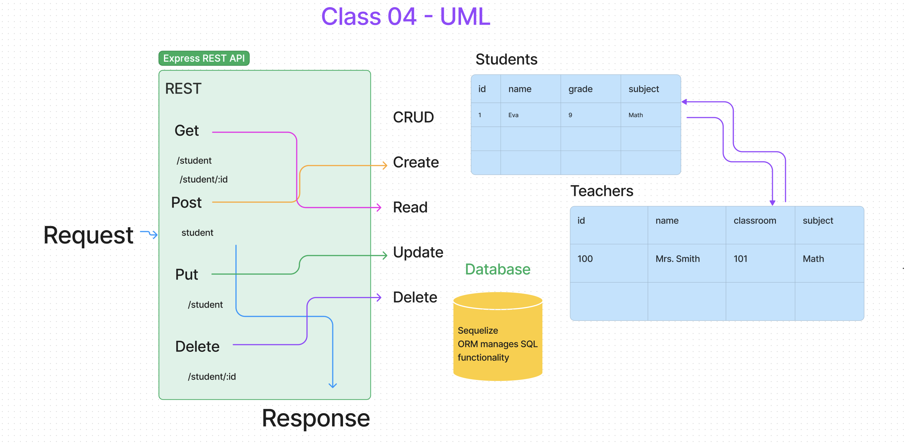

# LAB - Class 03

## Project: Project Name Here

### Author: Eva Grace Smith

### Problem Domain

Express Crud Server

### Links and Resources

- [back-end server url](http://xyz.com) (when applicable)


### Collaborators

TA: [Daniel Frey](https://github.com/DSFrey), Matt Miguel,

Classmates: Kati Lee, Tim Maupin

### Setup

npm i

#### `.env` requirements (where applicable)

for now I have none and do not require one


#### How to initialize/run your application (where applicable)

`npm start`

#### How to use your library (where applicable)

#### Features / Routes

- Feature One: SQL data models using the Sequelize library
- GET : `/student` - specific route to hit


## UML




```json
{
  "homepage": "https://yourname.github.io/repository-name"
}
```

